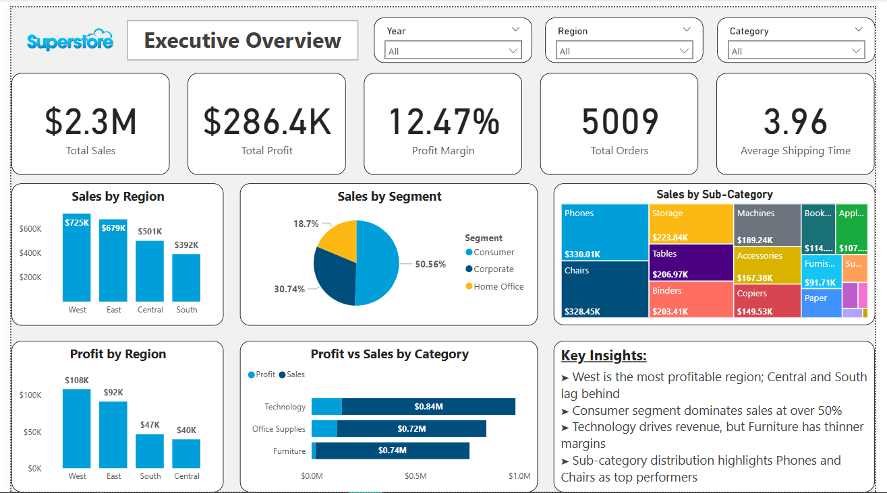

# Retail Sales & Logistics Dashboard (Power BI)

This project showcases a comprehensive **interactive Power BI dashboard** built using the Superstore dataset to analyze **sales performance, profit margins, shipping behavior**, and **logistics inefficiencies**.

---

## Objective

To develop an executive-ready business intelligence report that identifies:
- Top-performing and underperforming products
- Regional trends in sales, profit, and shipping times
- Customer segment behavior and market distribution
- Operational issues through negative profit analysis and shipping lags

---

## Key Features

- **Executive Overview**:
  - KPIs: Total Sales, Profit, Margin, Orders, Shipping Time
  - Dynamic filters by Year, Region, Category
  - Sales and Profit by Region, Segment, Sub-Category, and Category

- **Logistics & Loss Analysis**:
  - Top 10 Products by Negative Profit
  - Regional shipping time comparison
  - Ship mode distribution and efficiency
  - Strategic insights via clean, story-driven visuals

---

## Tools Used

- **Power BI Desktop**
- DAX for calculated measures and KPIs
- Power Query for data transformation
- Custom visual formatting and synced slicers

---

## Dataset

- Source: [Superstore Dataset - Kaggle](https://www.kaggle.com/datasets/vivek468/superstore-dataset-final)
- Scope: 10,000+ transactions across US retail stores

---

## Key Insights

- West is the most profitable region; Central and South lag behind
- Technology category yields the highest revenue
- Standard Class shipping dominates at nearly 60%
- Several tech-focused products incur high losses
- Central region has the slowest shipping time on average

---

## Screenshots

| Executive Overview | Logistics & Loss Analysis |
|--------------------|----------------------------|
|  |  |

> _Note: Filters on Page 1 also apply to Page 2 for cross-page interactivity._

---

